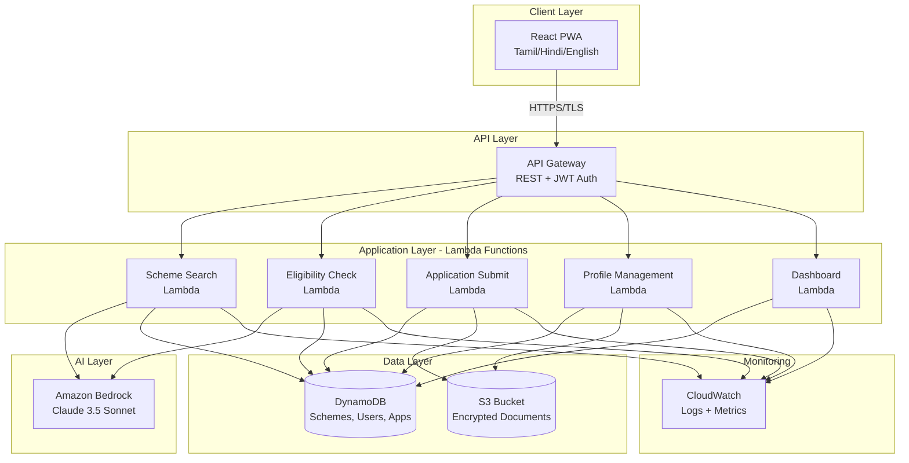

# Design Document: Nilai Platform

## Overview

### Purpose

The Nilai platform is an AI-powered government scheme discovery system that enables 800+ million Indians to discover, verify eligibility for, and apply to government welfare schemes through natural language conversations in their native language. This design document specifies the Phase 1 MVP architecture supporting 10,000 users, 20-30 schemes, and three languages (Tamil, Hindi, English).

### Design Philosophy

1. **AI-First**: Leverage Amazon Bedrock (Claude 3.5 Sonnet) for natural language understanding, eligibility reasoning, and explainable decisions
2. **Serverless Architecture**: Use AWS Lambda for automatic scaling, cost efficiency, and minimal operational overhead
3. **Security by Design**: Encrypt all data at rest and in transit, implement least-privilege access, store data in India
4. **Progressive Enhancement**: Build PWA for offline capability while maintaining web accessibility
5. **Multilingual Core**: Design all components to handle Tamil, Hindi, and English from the ground up
6. **Explainable AI**: Ensure all AI decisions can be traced back to specific criteria and data

### Key Design Decisions

**Decision 1: Amazon Bedrock (Claude 3.5 Sonnet) for AI**
- Rationale: Superior multilingual understanding, strong reasoning capabilities, built-in safety guardrails
- Alternative considered: OpenAI GPT-4 (rejected due to data residency concerns)
- Trade-off: Higher cost per token, but better accuracy and compliance

**Decision 2: DynamoDB for Primary Database**
- Rationale: Serverless, automatic scaling, single-digit millisecond latency, strong consistency
- Alternative considered: RDS PostgreSQL (rejected due to operational overhead and scaling complexity)
- Trade-off: Limited query flexibility, but sufficient for access patterns

**Decision 3: Manual Document Data Entry (Phase 1)**
- Rationale: Reduces MVP complexity, allows validation of core workflows before adding OCR
- Alternative considered: Amazon Textract from day 1 (deferred to Phase 2)
- Trade-off: Higher user friction, but faster MVP delivery

**Decision 4: Hardcoded i18n Translations (Phase 1)**
- Rationale: Simpler implementation, full control over translation quality
- Alternative considered: Amazon Translate API (deferred to Phase 2)
- Trade-off: Manual translation effort, but better quality for critical UI elements


## Architecture

### System Architecture Diagram



### Component Architecture

#### Frontend: React PWA

**Technology Stack:**
- React 18 with TypeScript
- React Router for navigation
- React Query for API state management
- i18next for internationalization
- Tailwind CSS for styling
- Workbox for service worker and offline support

**Key Modules:**
1. **Language Selector**: Detects browser language, allows manual switching, persists preference
2. **Scheme Discovery UI**: Chat-like interface for natural language queries, displays ranked results
3. **Eligibility Checker UI**: Step-by-step form for profile data, displays eligibility decisions with explanations
4. **Application Assistant UI**: Multi-step form with document upload, real-time validation, progress tracking
5. **Profile Management UI**: CRUD operations for user profile and documents
6. **Dashboard UI**: Charts and maps showing community impact metrics
7. **Offline Manager**: Service worker caching strategy, sync queue for offline actions

**State Management:**
- React Query for server state (API responses, caching, optimistic updates)
- React Context for global UI state (language, authentication, theme)
- Local Storage for persistence (language preference, JWT token, offline queue)


#### Backend: AWS Lambda Functions

**Technology Stack:**
- Node.js 20.x runtime for API handlers
- Python 3.12 runtime for AI integration (better Bedrock SDK support)
- AWS SDK v3 for service integration
- Zod for request validation
- Winston for structured logging

**Lambda Functions:**

**1. Scheme Search Lambda (Python)**
```python
# Input: { query: string, language: string, userId: string }
# Output: { schemes: Array<SchemeMatch>, conversationId: string }

def handler(event, context):
    # 1. Extract query and user context
    # 2. Call Bedrock to extract intent and demographic factors
    # 3. Query DynamoDB for matching schemes
    # 4. Call Bedrock to rank schemes by relevance
    # 5. Return ranked results with explanations
```

**2. Eligibility Check Lambda (Python)**
```python
# Input: { schemeId: string, userId: string }
# Output: { eligible: boolean, explanation: string, missingCriteria: Array }

def handler(event, context):
    # 1. Fetch scheme eligibility criteria from DynamoDB
    # 2. Fetch user profile from DynamoDB
    # 3. Call Bedrock to evaluate all criteria with reasoning
    # 4. Return decision with detailed explanation
    # 5. If ineligible, suggest alternative schemes
```

**3. Application Submit Lambda (Node.js)**
```javascript
// Input: { schemeId, userId, formData, documents }
// Output: { applicationId, status, message }

async function handler(event, context) {
    // 1. Validate form data against scheme requirements
    // 2. Upload documents to S3 with encryption
    // 3. Create application record in DynamoDB
    // 4. Return application ID and confirmation
}
```

**4. Profile Management Lambda (Node.js)**
```javascript
// Input: { userId, action: 'create'|'read'|'update'|'delete', profileData }
// Output: { profile, message }

async function handler(event, context) {
    // 1. Authenticate and authorize user
    // 2. Perform CRUD operation on DynamoDB
    // 3. Handle document uploads/deletions in S3
    // 4. Return updated profile
}
```

**5. Dashboard Lambda (Node.js)**
```javascript
// Input: { level: 'village'|'district'|'state', locationId, timeRange }
// Output: { metrics: DashboardMetrics }

async function handler(event, context) {
    // 1. Query aggregated metrics from DynamoDB
    // 2. Calculate success rates and totals
    // 3. Return formatted dashboard data
}
```

**Lambda Configuration:**
- Memory: 512 MB (API handlers), 1024 MB (AI integration)
- Timeout: 30 seconds (API handlers), 60 seconds (AI integration)
- Concurrency: Reserved concurrency of 100 per function
- Environment Variables: BEDROCK_MODEL_ID, DDB_TABLE_NAMES, S3_BUCKET_NAME, LOG_LEVEL


#### AI Layer: Amazon Bedrock Integration

**Model Selection:** Claude 3.5 Sonnet (anthropic.claude-3-5-sonnet-20241022-v2:0)

**Bedrock Usage Patterns:**

**Pattern 1: Intent Extraction**
```python
# Prompt Template
system_prompt = """You are an AI assistant for Nilai, a government scheme discovery platform in India.
Extract the user's intent and demographic context from their query.

Return JSON with:
- intent: string (e.g., "find_agriculture_schemes", "education_support", "disability_benefits")
- demographics: { age?, occupation?, location?, income_level?, category?, disability? }
- language: "tamil" | "hindi" | "english"
"""

user_prompt = f"User query: {query}"

response = bedrock.invoke_model(
    modelId="anthropic.claude-3-5-sonnet-20241022-v2:0",
    body={
        "anthropic_version": "bedrock-2023-05-31",
        "max_tokens": 500,
        "system": system_prompt,
        "messages": [{"role": "user", "content": user_prompt}]
    }
)
```

**Pattern 2: Scheme Ranking**
```python
# Prompt Template
system_prompt = """You are an AI assistant ranking government schemes by relevance.
Given a user's query and a list of matching schemes, rank them by relevance score (0-100).

Consider:
- Direct match to user's stated need
- Alignment with user demographics
- Benefit amount and impact
- Application complexity

Return JSON array: [{ schemeId, relevanceScore, reason }]
"""

user_prompt = f"""
User query: {query}
User profile: {user_profile}
Matching schemes: {schemes}
"""
```

**Pattern 3: Eligibility Reasoning**
```python
# Prompt Template
system_prompt = """You are an AI assistant evaluating eligibility for government schemes.
Given scheme criteria and user profile, determine eligibility with detailed reasoning.

Rules:
- ALL criteria must be met for eligibility
- Be precise about which criteria are met/not met
- If data is missing, list what's needed
- Cite specific criteria in your explanation

Return JSON:
{
  "eligible": boolean,
  "confidence": 0-100,
  "explanation": string,
  "criteriaEvaluation": [{ criterion, met: boolean, reason }],
  "missingData": string[]
}
"""

user_prompt = f"""
Scheme: {scheme_name}
Eligibility Criteria: {criteria}
User Profile: {user_profile}
"""
```

**Bedrock Configuration:**
- Temperature: 0.1 (low for factual accuracy)
- Top P: 0.9
- Max Tokens: 1000 (intent extraction), 2000 (ranking), 1500 (eligibility)
- Stop Sequences: None
- Timeout: 25 seconds (allows 5 seconds for Lambda processing)

**Error Handling:**
- Retry logic: 3 attempts with exponential backoff (1s, 2s, 4s)
- Fallback: If Bedrock fails, return cached results or graceful error
- Validation: Parse and validate JSON responses, reject malformed outputs

**Cost Optimization:**
- Cache frequent queries (e.g., popular schemes) in DynamoDB with TTL
- Batch similar requests when possible
- Use prompt compression techniques
- Monitor token usage via CloudWatch


## Components and Interfaces

### API Endpoints

**Base URL:** `https://api.nilai.gov.in/v1`

**Authentication:** JWT Bearer tokens in Authorization header

#### 1. Scheme Discovery

**POST /schemes/search**
```typescript
Request:
{
  query: string;           // Natural language query
  language: 'ta' | 'hi' | 'en';
  conversationId?: string; // For multi-turn dialogue
}

Response:
{
  schemes: Array<{
    schemeId: string;
    name: string;
    description: string;
    benefits: string;
    eligibilitySummary: string;
    relevanceScore: number;
    category: string;
    targetBeneficiary: string;
  }>;
  conversationId: string;
  responseTime: number;
}
```

#### 2. Eligibility Check

**POST /eligibility/check**
```typescript
Request:
{
  schemeId: string;
  userId: string;
}

Response:
{
  eligible: boolean;
  confidence: number;      // 0-100
  explanation: string;
  criteriaEvaluation: Array<{
    criterion: string;
    met: boolean;
    reason: string;
  }>;
  missingData: string[];
  alternativeSchemes?: Array<{ schemeId: string; name: string }>;
}
```

#### 3. Application Management

**POST /applications**
```typescript
Request:
{
  schemeId: string;
  userId: string;
  formData: Record<string, any>;
  documents: Array<{
    type: string;
    fileName: string;
    fileData: string; // Base64 encoded
  }>;
}

Response:
{
  applicationId: string;
  status: 'submitted';
  submittedAt: string;
  message: string;
}
```

**GET /applications/:userId**
```typescript
Response:
{
  applications: Array<{
    applicationId: string;
    schemeId: string;
    schemeName: string;
    status: 'submitted' | 'under_review' | 'approved' | 'rejected' | 'pending_documents';
    submittedAt: string;
    updatedAt: string;
    statusHistory: Array<{ status: string; timestamp: string }>;
  }>;
}
```

#### 4. Profile Management

**POST /profile**
```typescript
Request:
{
  name: string;
  age: number;
  location: {
    state: string;
    district: string;
    village?: string;
  };
  occupation: string;
  incomeRange: string;
  category?: 'SC' | 'ST' | 'OBC' | 'General';
  disability?: boolean;
  language: 'ta' | 'hi' | 'en';
}

Response:
{
  userId: string;
  profile: UserProfile;
  message: string;
}
```

**GET /profile/:userId**
**PUT /profile/:userId**
**DELETE /profile/:userId**

#### 5. Dashboard

**GET /dashboard**
```typescript
Query Parameters:
{
  level: 'village' | 'district' | 'state';
  locationId: string;
  timeRange: '7d' | '30d' | '90d' | 'all';
}

Response:
{
  totalBenefitsUnlocked: number;  // In rupees
  totalApplications: number;
  successfulApplications: number;
  successRate: number;            // Percentage
  topSchemes: Array<{
    schemeId: string;
    name: string;
    applicationCount: number;
    successRate: number;
  }>;
  categoryBreakdown: Record<string, number>;
  geographicData: Array<{
    district: string;
    applicationCount: number;
    benefitsUnlocked: number;
  }>;
}
```

### Internal Interfaces

#### Bedrock Service Interface

```typescript
interface BedrockService {
  extractIntent(query: string, language: string): Promise<IntentResult>;
  rankSchemes(query: string, userProfile: UserProfile, schemes: Scheme[]): Promise<RankedScheme[]>;
  evaluateEligibility(scheme: Scheme, userProfile: UserProfile): Promise<EligibilityResult>;
}

interface IntentResult {
  intent: string;
  demographics: {
    age?: number;
    occupation?: string;
    location?: string;
    incomeLevel?: string;
    category?: string;
    disability?: boolean;
  };
  language: 'tamil' | 'hindi' | 'english';
}

interface RankedScheme {
  schemeId: string;
  relevanceScore: number;
  reason: string;
}

interface EligibilityResult {
  eligible: boolean;
  confidence: number;
  explanation: string;
  criteriaEvaluation: Array<{
    criterion: string;
    met: boolean;
    reason: string;
  }>;
  missingData: string[];
}
```

#### Database Service Interface

```typescript
interface DatabaseService {
  // Schemes
  getScheme(schemeId: string): Promise<Scheme>;
  querySchemes(filters: SchemeFilters): Promise<Scheme[]>;
  
  // Users
  createUser(profile: UserProfile): Promise<string>;
  getUser(userId: string): Promise<UserProfile>;
  updateUser(userId: string, updates: Partial<UserProfile>): Promise<void>;
  deleteUser(userId: string): Promise<void>;
  
  // Applications
  createApplication(application: Application): Promise<string>;
  getApplications(userId: string): Promise<Application[]>;
  updateApplicationStatus(applicationId: string, status: string): Promise<void>;
  
  // Dashboard
  getAggregatedMetrics(filters: DashboardFilters): Promise<DashboardMetrics>;
}
```

#### Document Storage Interface

```typescript
interface DocumentStorage {
  uploadDocument(userId: string, document: Document): Promise<string>;
  getDocument(userId: string, documentId: string): Promise<Document>;
  deleteDocument(userId: string, documentId: string): Promise<void>;
  listDocuments(userId: string): Promise<DocumentMetadata[]>;
}

interface Document {
  documentId: string;
  type: string;
  fileName: string;
  fileData: Buffer;
  uploadedAt: string;
}
```


## Data Models

### DynamoDB Table Design

**Design Approach:** Single-table design with composite keys for efficient access patterns

**Table Name:** `nilai-platform-data`

**Primary Key:**
- Partition Key (PK): `string`
- Sort Key (SK): `string`

**Global Secondary Indexes:**

**GSI1:** For querying by type and status
- GSI1PK: `string` (entity type)
- GSI1SK: `string` (status or timestamp)

**GSI2:** For geographic queries
- GSI2PK: `string` (location identifier)
- GSI2SK: `string` (timestamp)

### Entity Models

#### 1. Scheme Entity

```typescript
interface Scheme {
  PK: `SCHEME#${schemeId}`;
  SK: `METADATA`;
  GSI1PK: `SCHEME`;
  GSI1SK: `${category}#${state}`;
  
  schemeId: string;
  name: {
    en: string;
    ta: string;
    hi: string;
  };
  description: {
    en: string;
    ta: string;
    hi: string;
  };
  category: 'agriculture' | 'education' | 'health' | 'housing' | 'employment' | 'social_welfare';
  targetBeneficiary: 'farmer' | 'student' | 'woman' | 'senior_citizen' | 'disabled' | 'msme' | 'general';
  state: string;  // 'TN' for Tamil Nadu, 'CENTRAL' for central schemes
  benefits: {
    en: string;
    ta: string;
    hi: string;
  };
  eligibilityCriteria: {
    age?: { min?: number; max?: number };
    income?: { max: number };  // Annual income in rupees
    location?: { states: string[]; districts?: string[] };
    category?: ('SC' | 'ST' | 'OBC' | 'General')[];
    occupation?: string[];
    disability?: boolean;
    gender?: 'male' | 'female' | 'other' | 'any';
    customCriteria?: Array<{
      field: string;
      operator: 'eq' | 'gt' | 'lt' | 'gte' | 'lte' | 'in';
      value: any;
    }>;
  };
  applicationProcess: {
    en: string;
    ta: string;
    hi: string;
  };
  requiredDocuments: string[];
  officialLink: string;
  benefitAmount?: number;  // In rupees, if fixed amount
  active: boolean;
  createdAt: string;
  updatedAt: string;
  version: number;
}
```

#### 2. User Profile Entity

```typescript
interface UserProfile {
  PK: `USER#${userId}`;
  SK: `PROFILE`;
  GSI1PK: `USER`;
  GSI1SK: `${state}#${district}`;
  GSI2PK: `LOCATION#${state}#${district}`;
  GSI2SK: `${createdAt}`;
  
  userId: string;
  name: string;  // Encrypted
  age: number;
  location: {
    state: string;
    district: string;
    village?: string;
    pincode?: string;
  };
  occupation: string;
  incomeRange: '<50000' | '50000-100000' | '100000-250000' | '250000-500000' | '>500000';
  category?: 'SC' | 'ST' | 'OBC' | 'General';
  disability?: boolean;
  gender?: 'male' | 'female' | 'other';
  language: 'ta' | 'hi' | 'en';
  phone?: string;  // Encrypted
  email?: string;  // Encrypted
  aadhaarNumber?: string;  // Encrypted
  consentGiven: boolean;
  consentTimestamp: string;
  createdAt: string;
  updatedAt: string;
}
```

#### 3. Application Entity

```typescript
interface Application {
  PK: `USER#${userId}`;
  SK: `APPLICATION#${applicationId}`;
  GSI1PK: `APPLICATION`;
  GSI1SK: `${status}#${submittedAt}`;
  GSI2PK: `SCHEME#${schemeId}`;
  GSI2SK: `${submittedAt}`;
  
  applicationId: string;
  userId: string;
  schemeId: string;
  schemeName: string;
  status: 'submitted' | 'under_review' | 'approved' | 'rejected' | 'pending_documents';
  formData: Record<string, any>;
  documents: Array<{
    documentId: string;
    type: string;
    fileName: string;
    s3Key: string;
    uploadedAt: string;
  }>;
  statusHistory: Array<{
    status: string;
    timestamp: string;
    notes?: string;
  }>;
  submittedAt: string;
  updatedAt: string;
  approvedAmount?: number;  // If approved, benefit amount
}
```

#### 4. Dashboard Metrics Entity

```typescript
interface DashboardMetrics {
  PK: `METRICS#${level}#${locationId}`;
  SK: `DATE#${date}`;
  GSI1PK: `METRICS`;
  GSI1SK: `${date}`;
  
  level: 'village' | 'district' | 'state';
  locationId: string;
  date: string;  // YYYY-MM-DD
  totalApplications: number;
  successfulApplications: number;
  totalBenefitsUnlocked: number;
  schemeBreakdown: Record<string, {
    applicationCount: number;
    successCount: number;
    benefitsUnlocked: number;
  }>;
  categoryBreakdown: Record<string, number>;
  updatedAt: string;
}
```

#### 5. Conversation Context Entity

```typescript
interface ConversationContext {
  PK: `USER#${userId}`;
  SK: `CONVERSATION#${conversationId}`;
  
  conversationId: string;
  userId: string;
  messages: Array<{
    role: 'user' | 'assistant';
    content: string;
    timestamp: string;
  }>;
  extractedIntent?: IntentResult;
  language: 'ta' | 'hi' | 'en';
  createdAt: string;
  expiresAt: number;  // TTL for automatic cleanup (24 hours)
}
```

### S3 Bucket Structure

**Bucket Name:** `nilai-platform-documents-${region}`

**Encryption:** AES-256 server-side encryption (SSE-S3)

**Directory Structure:**
```
/users/
  /{userId}/
    /aadhaar/
      /{documentId}.pdf
    /income-certificate/
      /{documentId}.pdf
    /land-records/
      /{documentId}.pdf
    /disability-certificate/
      /{documentId}.pdf
    /other/
      /{documentId}.{ext}
```

**Object Metadata:**
- `x-amz-meta-user-id`: User ID
- `x-amz-meta-document-type`: Document type
- `x-amz-meta-uploaded-at`: Upload timestamp
- `x-amz-meta-file-name`: Original file name

**Lifecycle Policy:**
- Transition to S3 Glacier after 90 days
- Delete after 7 years (compliance requirement)

### Access Patterns and Queries

**Access Pattern 1:** Get all active schemes by category
```
Query: GSI1
GSI1PK = "SCHEME"
GSI1SK begins_with "agriculture#"
FilterExpression: active = true
```

**Access Pattern 2:** Get user profile
```
Query: Primary Key
PK = "USER#{userId}"
SK = "PROFILE"
```

**Access Pattern 3:** Get all applications for a user
```
Query: Primary Key
PK = "USER#{userId}"
SK begins_with "APPLICATION#"
```

**Access Pattern 4:** Get applications by status
```
Query: GSI1
GSI1PK = "APPLICATION"
GSI1SK begins_with "submitted#"
```

**Access Pattern 5:** Get metrics for a location
```
Query: Primary Key
PK = "METRICS#district#TN-Chennai"
SK begins_with "DATE#2024"
```

**Access Pattern 6:** Get all applications for a scheme
```
Query: GSI2
GSI2PK = "SCHEME#{schemeId}"
SK begins_with timestamp range
```


## Correctness Properties

### What are Correctness Properties?

A property is a characteristic or behavior that should hold true across all valid executions of a system—essentially, a formal statement about what the system should do. Properties serve as the bridge between human-readable specifications and machine-verifiable correctness guarantees.

In the Nilai platform, correctness properties ensure that our AI-powered scheme discovery, eligibility checking, and application assistance work reliably across all user inputs, languages, and scenarios. These properties will be validated through property-based testing, which generates hundreds of random test cases to verify that the properties hold universally.

### Core System Properties

#### Property 1: Intent Extraction Completeness
*For any* natural language query in Tamil, Hindi, or English, the Scheme_Discovery_Engine should extract a structured intent result containing at least an intent classification and language identification, even if demographic factors cannot be determined.

**Validates: Requirements 1.1, 1.2**

#### Property 2: Scheme Query Execution
*For any* valid extracted intent, querying the Scheme_Database should return a list of schemes (which may be empty if no matches exist), and the query should complete without errors.

**Validates: Requirements 1.3**

#### Property 3: Relevance Score Ordering
*For any* set of matching schemes with relevance scores, the returned results should be ordered in descending order by relevance score (highest relevance first).

**Validates: Requirements 1.4**

#### Property 4: Response Language Consistency
*For any* query in a specific language (Tamil, Hindi, or English), all response content including scheme names, descriptions, UI elements, error messages, and form labels should be rendered in that same language.

**Validates: Requirements 1.5, 4.3, 4.5, 4.6, 4.7**

#### Property 5: Conversation Context Preservation
*For any* multi-turn conversation, when a follow-up query is submitted with a conversation ID, the system should maintain access to previous messages and extracted context from earlier turns.

**Validates: Requirements 1.6**

#### Property 6: Code-Mixed Query Robustness
*For any* query containing mixed languages (e.g., Tamil-English or Hindi-English), the Intent_Extractor should successfully extract intent without errors and return a valid intent result.

**Validates: Requirements 1.7**

### Eligibility Verification Properties

#### Property 7: Criteria Retrieval Completeness
*For any* valid scheme ID, the Eligibility_Checker should retrieve a complete set of eligibility criteria including all defined rules (age, income, location, category, etc.).

**Validates: Requirements 2.1**

#### Property 8: Multi-Factor Eligibility Evaluation
*For any* user profile and scheme with multiple eligibility criteria, the Eligibility_Checker should evaluate ALL criteria and return evaluation results for each criterion (not just the first failing criterion).

**Validates: Requirements 2.2**

#### Property 9: Missing Data Detection
*For any* user profile with incomplete data and a scheme requiring that data, the Eligibility_Checker should identify and list all missing required fields.

**Validates: Requirements 2.3**

#### Property 10: Eligibility Decision Validity
*For any* completed eligibility evaluation, the result should contain a valid decision (Eligible, Not Eligible, or Partially Eligible) and should never return null or undefined.

**Validates: Requirements 2.4**

#### Property 11: Explanation Presence
*For any* eligibility decision, the response should include a non-empty explanation string that describes the reasoning behind the decision.

**Validates: Requirements 2.5**

#### Property 12: Alternative Scheme Suggestions
*For any* eligibility check that returns "Not Eligible", the response should include at least one alternative scheme suggestion (if any schemes exist in the database that the user might qualify for).

**Validates: Requirements 2.6**

#### Property 13: Document Requirement Identification
*For any* scheme that has document requirements in its eligibility criteria, the Eligibility_Checker should include those document types in the response when documents are needed.

**Validates: Requirements 2.7**

### Application Assistant Properties

#### Property 14: Checklist Generation
*For any* scheme and user profile, starting an application should generate a checklist containing at least the required documents list and application steps.

**Validates: Requirements 3.1**

#### Property 15: Step Sequencing
*For any* generated application steps, each step should have a sequence number, and the steps should be ordered sequentially (1, 2, 3, ...) with no gaps or duplicates.

**Validates: Requirements 3.2**

#### Property 16: Document Validation
*For any* uploaded document, the validation process should check file format, file size, and return a validation result (pass or fail with reasons).

**Validates: Requirements 3.3**

#### Property 17: Auto-Fill Consistency
*For any* user profile field that matches an application form field name, the form field should be pre-populated with the profile value when the application is initialized.

**Validates: Requirements 3.4**

#### Property 18: Real-Time Input Validation
*For any* form input, submitting the value should trigger validation and return a validation result (valid or invalid with error message) before the form is submitted.

**Validates: Requirements 3.5**

#### Property 19: Application Record Creation
*For any* valid application submission, an Application_Record should be created in the database with a unique application ID and status "submitted".

**Validates: Requirements 3.6**

#### Property 20: Status Update Persistence
*For any* application status change, updating the status should persist the change to the Application_Record and add an entry to the status history with a timestamp.

**Validates: Requirements 3.7, 11.3**

#### Property 21: Application Retrieval Completeness
*For any* user ID, querying for applications should return all Application_Records associated with that user, with no records missing.

**Validates: Requirements 3.8**

### Multilingual Support Properties

#### Property 22: Language Detection
*For any* browser language setting (Tamil, Hindi, English, or other), the platform should detect it and set the default language to one of the supported languages (Tamil, Hindi, or English), defaulting to English for unsupported languages.

**Validates: Requirements 4.1**

#### Property 23: Language Preference Persistence (Round-Trip)
*For any* language preference change, persisting the preference and then retrieving it should return the same language value.

**Validates: Requirements 4.2**

#### Property 24: AI Language Parameter Passing
*For any* Bedrock API request, the request should include the user's selected language as a parameter in the prompt or system message.

**Validates: Requirements 4.4**

### User Profile Management Properties

#### Property 25: Unique User ID Generation
*For any* new user registration, the created User_Profile should have a unique user ID that does not conflict with any existing user ID in the database.

**Validates: Requirements 5.1**

#### Property 26: Document Encryption at Rest
*For any* document uploaded to S3, the stored file should be encrypted using AES-256 encryption (verified by S3 object metadata).

**Validates: Requirements 5.3, 7.1**

#### Property 27: Sensitive Field Encryption
*For any* User_Profile containing sensitive fields (Aadhaar number, phone number, email), those fields should be encrypted in the DynamoDB record.

**Validates: Requirements 5.4, 7.7, 15.2**

#### Property 28: Profile Update Consistency
*For any* valid profile update, the changes should be persisted to the database, and immediately retrieving the profile should reflect all the updates.

**Validates: Requirements 5.5**

#### Property 29: Profile Data Round-Trip
*For any* user profile created or updated, retrieving the profile should return all the same data that was stored (after decryption of encrypted fields).

**Validates: Requirements 5.6**

#### Property 30: Complete Data Deletion
*For any* user data deletion request, after deletion completes, querying for the user profile, documents, and applications should return no results or empty sets.

**Validates: Requirements 5.7, 15.6**

#### Property 31: Consent Recording
*For any* user registration or data collection action, a consent record should be created with a timestamp indicating when consent was obtained.

**Validates: Requirements 5.8, 15.4**

#### Property 32: Authentication Enforcement
*For any* API request to protected endpoints without a valid JWT token, the request should be rejected with a 401 Unauthorized status code.

**Validates: Requirements 5.9**

### Scheme Database Properties

#### Property 33: Scheme Data Completeness
*For any* new scheme added to the database, the stored record should contain all required fields: scheme ID, name (in all 3 languages), description (in all 3 languages), eligibility criteria, benefits, and active status.

**Validates: Requirements 6.1, 6.6**

#### Property 34: Version History Tracking
*For any* scheme update, a new version record should be created with an incremented version number and timestamp, preserving the previous version.

**Validates: Requirements 6.2**

#### Property 35: Machine-Readable Criteria Structure
*For any* scheme's eligibility criteria, the criteria should be structured as parseable JSON with defined fields (age, income, location, etc.) that can be programmatically evaluated.

**Validates: Requirements 6.3**

#### Property 36: Inactive Scheme Marking
*For any* scheme marked as inactive (active = false), the scheme should not appear in query results unless explicitly requested with an "include_inactive" flag.

**Validates: Requirements 6.4, 6.5**

#### Property 37: Multi-Criteria Query Support
*For any* combination of filter criteria (category, state, beneficiary type), the database query should support filtering by all provided criteria simultaneously using AND logic.

**Validates: Requirements 6.7**

#### Property 38: Scheme Metadata Presence
*For any* scheme in the database, the record should include category and target beneficiary tags for classification and filtering.

**Validates: Requirements 6.8**

### Document Security Properties

#### Property 39: S3 Key Structure Compliance
*For any* document uploaded to S3, the object key should follow the structure `/users/{userId}/{documentType}/{documentId}.{ext}` with all components present.

**Validates: Requirements 7.3**

#### Property 40: Document Access Authorization
*For any* document retrieval request, the system should verify that the requesting user ID matches the user ID in the document's S3 key path before allowing access.

**Validates: Requirements 7.4**

#### Property 41: Document Encryption Round-Trip
*For any* document uploaded, encrypting it during upload and then decrypting it during retrieval should produce a file with identical content to the original.

**Validates: Requirements 7.5**

#### Property 42: Document Deletion Completeness
*For any* document deletion request, after deletion completes, attempting to retrieve the document should return a "not found" error.

**Validates: Requirements 7.6**

#### Property 43: Unauthorized Access Logging
*For any* unauthorized access attempt (invalid JWT, mismatched user ID, etc.), the system should create a log entry in CloudWatch with details of the attempt and deny the request.

**Validates: Requirements 7.9**

### AI Response Quality Properties

#### Property 44: Uncertainty Acknowledgment
*For any* AI response with confidence score below 70%, the response should include explicit uncertainty language (e.g., "I'm not certain", "This may not be accurate").

**Validates: Requirements 8.3**

#### Property 45: Criteria Citation in Explanations
*For any* eligibility explanation generated by Bedrock, the explanation text should reference at least one specific criterion from the scheme's eligibility criteria.

**Validates: Requirements 8.4**

#### Property 46: No Approval Guarantees
*For any* AI-generated response about scheme eligibility or applications, the response should not contain guarantee words like "will be approved", "guaranteed", or "definitely eligible".

**Validates: Requirements 8.5**

#### Property 47: Out-of-Scope Query Handling
*For any* query about schemes not in the database, the AI response should explicitly state that the information is not available and suggest contacting support or checking official sources.

**Validates: Requirements 8.7**

### API and Error Handling Properties

#### Property 48: HTTP Status Code Appropriateness
*For any* API response, the HTTP status code should match the response type: 2xx for success, 4xx for client errors, 5xx for server errors.

**Validates: Requirements 9.3, 13.3**

#### Property 49: Error Logging Completeness
*For any* error that occurs in Lambda functions, an error log entry should be created in CloudWatch containing the error message, stack trace, and request context.

**Validates: Requirements 9.4, 14.2**

#### Property 50: Structured Error Response Format
*For any* API error response (4xx or 5xx), the response body should be valid JSON containing at least an error code and error message field.

**Validates: Requirements 13.4**

#### Property 51: JWT Authentication Validation
*For any* API request to protected endpoints, the request should be validated for a JWT token in the Authorization header, and invalid/missing tokens should result in 401 responses.

**Validates: Requirements 13.1**

#### Property 52: Request Parameter Validation
*For any* API request with invalid parameters (wrong type, missing required fields, out of range values), the API should return a 400 Bad Request with details of the validation errors.

**Validates: Requirements 13.2**

#### Property 53: CORS Header Presence
*For any* API response, the response headers should include appropriate CORS headers (Access-Control-Allow-Origin, etc.) to enable cross-origin requests from the frontend.

**Validates: Requirements 13.5**

#### Property 54: Rate Limiting Enforcement
*For any* user making more than 100 requests in a 60-second window, subsequent requests should be rejected with a 429 Too Many Requests status code.

**Validates: Requirements 13.6, 13.8**

#### Property 55: API Version Support
*For any* API endpoint, the URL path should include a version prefix (e.g., /v1/) to support future API versioning.

**Validates: Requirements 13.7**

### Dashboard and Analytics Properties

#### Property 56: Dashboard Metrics Presence
*For any* dashboard request, the response should include all required metrics: total benefits unlocked, total applications, successful applications, and success rate.

**Validates: Requirements 10.1, 10.2**

#### Property 57: Top Schemes Ranking
*For any* dashboard response, the top 10 schemes should be ranked by application count in descending order (highest count first).

**Validates: Requirements 10.3**

#### Property 58: Success Rate Calculation Accuracy
*For any* set of applications, the calculated success rate should equal (successful applications / total applications) * 100, rounded to two decimal places.

**Validates: Requirements 10.4**

#### Property 59: Geographic Data Formatting
*For any* dashboard with geographic data, each location entry should include district name, application count, and benefits unlocked amount.

**Validates: Requirements 10.5**

#### Property 60: Data Anonymization
*For any* dashboard data displayed, the response should not contain any personally identifiable information (names, Aadhaar numbers, phone numbers, emails).

**Validates: Requirements 10.7**

#### Property 61: Time Range Filtering
*For any* dashboard request with a time range filter, only applications with submission dates within the specified range should be included in the metrics.

**Validates: Requirements 10.8**

### Application Tracking Properties

#### Property 62: Unique Application ID Assignment
*For any* application submission, the assigned application ID should be unique and not conflict with any existing application ID in the database.

**Validates: Requirements 11.1**

#### Property 63: Current Status Retrieval
*For any* application query, the response should include the most recent status from the status history as the current status.

**Validates: Requirements 11.2**

#### Property 64: Status History Chronological Ordering
*For any* application with multiple status changes, the status history array should be ordered chronologically by timestamp (earliest first or latest first, but consistently).

**Validates: Requirements 11.4**

#### Property 65: Document Requirement Messaging
*For any* application with status "pending_documents", the response should include a list of required document types that are missing.

**Validates: Requirements 11.5**

#### Property 66: Application List Sorting
*For any* user with multiple applications, the returned list should be sorted by submission date in descending order (most recent first).

**Validates: Requirements 11.6**

#### Property 67: Application Status Filtering
*For any* application list request with a status filter, only applications matching the specified status should be returned.

**Validates: Requirements 11.7**

#### Property 68: Final Decision Explanation
*For any* application with status "approved" or "rejected", the Application_Record should include an explanation field with a non-empty explanation of the decision.

**Validates: Requirements 11.8**

### PWA and Offline Properties

#### Property 69: Offline Resource Availability
*For any* resource marked for offline caching (UI components, static assets), the resource should be retrievable from the service worker cache when the device is offline.

**Validates: Requirements 12.3**

#### Property 70: Sync Queue Processing
*For any* action queued while offline (form submission, document upload), when connectivity is restored, the action should be automatically synced to the server.

**Validates: Requirements 12.4**

#### Property 71: Offline Status Messaging
*For any* page load while offline, the UI should display a message indicating that the user is offline and functionality is limited.

**Validates: Requirements 12.6**

#### Property 72: Update Notification
*For any* PWA version update, when a new version is detected, the UI should display a prompt asking the user to refresh to get the latest version.

**Validates: Requirements 12.8**

### Monitoring and Observability Properties

#### Property 73: Lambda Invocation Logging
*For any* Lambda function execution, a log entry should be created in CloudWatch containing the function name, execution time, and completion status.

**Validates: Requirements 14.1**

#### Property 74: API Request Logging
*For any* API request, a log entry should be created containing the request method, path, status code, and response time.

**Validates: Requirements 14.3**

#### Property 75: Metrics Collection
*For any* API request, metrics should be recorded for latency, error rate, and throughput, and should be queryable in CloudWatch.

**Validates: Requirements 14.4**

#### Property 76: Bedrock Token Usage Logging
*For any* Bedrock API call, a log entry should be created containing the model ID, input tokens, output tokens, and total cost.

**Validates: Requirements 14.5**

#### Property 77: Database Query Performance Logging
*For any* DynamoDB query, a log entry should be created containing the table name, query type, and execution time.

**Validates: Requirements 14.6**

#### Property 78: Critical Error Alerting
*For any* error classified as critical (5xx errors, Bedrock failures, database unavailability), a CloudWatch alarm should be triggered.

**Validates: Requirements 14.7**

### Compliance Properties

#### Property 79: Privacy Policy Display
*For any* user registration flow, the privacy policy and terms of service should be displayed to the user before account creation is completed.

**Validates: Requirements 15.3**

#### Property 80: Data Export Completeness
*For any* user data export request, the exported data should include all stored information: profile data, documents, applications, and consent records.

**Validates: Requirements 15.5**


## Error Handling

### Error Classification

**Level 1: User Errors (4xx)**
- Invalid input data
- Missing required fields
- Authentication failures
- Authorization failures
- Rate limit exceeded

**Level 2: System Errors (5xx)**
- Lambda function failures
- DynamoDB throttling or unavailability
- S3 upload/download failures
- Bedrock API failures or timeouts

**Level 3: External Service Errors**
- AWS service outages
- Network connectivity issues
- Third-party API failures

### Error Handling Strategies

#### 1. Bedrock API Failures

**Retry Strategy:**
```python
def call_bedrock_with_retry(prompt, max_retries=3):
    for attempt in range(max_retries):
        try:
            response = bedrock.invoke_model(...)
            return response
        except ThrottlingException:
            wait_time = 2 ** attempt  # Exponential backoff: 1s, 2s, 4s
            time.sleep(wait_time)
        except ModelTimeoutException:
            if attempt == max_retries - 1:
                return fallback_response()
        except Exception as e:
            log_error(e)
            if attempt == max_retries - 1:
                raise
```

**Fallback Behavior:**
- Return cached results if available
- Use rule-based matching as fallback for scheme discovery
- Display maintenance message to user
- Queue request for later retry

#### 2. DynamoDB Errors

**Throttling Handling:**
```javascript
const dynamoRetry = {
  maxRetries: 3,
  retryDelayOptions: {
    base: 100,  // 100ms base delay
    customBackoff: (retryCount) => Math.pow(2, retryCount) * 100
  }
};
```

**Conditional Write Failures:**
- Use optimistic locking with version numbers
- Retry with fresh data on version mismatch
- Return conflict error to user if retries exhausted

**Capacity Exceeded:**
- Enable auto-scaling for tables
- Use on-demand billing mode for unpredictable traffic
- Implement request queuing for burst traffic

#### 3. S3 Upload/Download Failures

**Upload Retry:**
```javascript
async function uploadWithRetry(file, key, maxRetries = 3) {
  for (let attempt = 0; attempt < maxRetries; attempt++) {
    try {
      await s3.putObject({
        Bucket: bucket,
        Key: key,
        Body: file,
        ServerSideEncryption: 'AES256'
      });
      return { success: true, key };
    } catch (error) {
      if (attempt === maxRetries - 1) {
        return { success: false, error: error.message };
      }
      await sleep(1000 * (attempt + 1));
    }
  }
}
```

**Partial Upload Handling:**
- Use multipart upload for files > 5 MB
- Track upload progress
- Resume from last successful part on failure

#### 4. Authentication and Authorization Errors

**JWT Validation:**
```javascript
function validateJWT(token) {
  try {
    const decoded = jwt.verify(token, publicKey);
    return { valid: true, userId: decoded.sub };
  } catch (error) {
    if (error.name === 'TokenExpiredError') {
      return { valid: false, error: 'token_expired' };
    }
    if (error.name === 'JsonWebTokenError') {
      return { valid: false, error: 'invalid_token' };
    }
    return { valid: false, error: 'authentication_failed' };
  }
}
```

**Response:**
- 401 Unauthorized for invalid/expired tokens
- Include error code and message in response
- Frontend should redirect to login page

#### 5. Input Validation Errors

**Validation Strategy:**
```typescript
import { z } from 'zod';

const SchemeSearchSchema = z.object({
  query: z.string().min(1).max(500),
  language: z.enum(['ta', 'hi', 'en']),
  conversationId: z.string().uuid().optional()
});

function validateRequest(data: unknown) {
  try {
    return SchemeSearchSchema.parse(data);
  } catch (error) {
    if (error instanceof z.ZodError) {
      return {
        valid: false,
        errors: error.errors.map(e => ({
          field: e.path.join('.'),
          message: e.message
        }))
      };
    }
  }
}
```

**Response Format:**
```json
{
  "error": "validation_error",
  "message": "Invalid request parameters",
  "details": [
    {
      "field": "query",
      "message": "Query must be between 1 and 500 characters"
    }
  ]
}
```

#### 6. Rate Limiting

**Implementation:**
```javascript
const rateLimiter = {
  windowMs: 60 * 1000,  // 1 minute
  maxRequests: 100,
  keyGenerator: (req) => req.userId,
  handler: (req, res) => {
    res.status(429).json({
      error: 'rate_limit_exceeded',
      message: 'Too many requests, please try again later',
      retryAfter: 60
    });
  }
};
```

### Error Response Format

**Standard Error Response:**
```typescript
interface ErrorResponse {
  error: string;           // Error code (snake_case)
  message: string;         // Human-readable message
  details?: any;           // Additional error details
  requestId: string;       // For tracking and support
  timestamp: string;       // ISO 8601 timestamp
}
```

**Example Responses:**

```json
// 400 Bad Request
{
  "error": "invalid_input",
  "message": "Age must be between 0 and 120",
  "details": { "field": "age", "value": 150 },
  "requestId": "req_abc123",
  "timestamp": "2024-01-15T10:30:00Z"
}

// 401 Unauthorized
{
  "error": "authentication_required",
  "message": "Valid JWT token required",
  "requestId": "req_def456",
  "timestamp": "2024-01-15T10:30:00Z"
}

// 404 Not Found
{
  "error": "resource_not_found",
  "message": "Scheme with ID 'scheme_123' not found",
  "requestId": "req_ghi789",
  "timestamp": "2024-01-15T10:30:00Z"
}

// 500 Internal Server Error
{
  "error": "internal_server_error",
  "message": "An unexpected error occurred. Please try again later.",
  "requestId": "req_jkl012",
  "timestamp": "2024-01-15T10:30:00Z"
}

// 503 Service Unavailable
{
  "error": "service_unavailable",
  "message": "AI service is temporarily unavailable. Please try again in a few minutes.",
  "requestId": "req_mno345",
  "timestamp": "2024-01-15T10:30:00Z"
}
```

### Logging Strategy

**Log Levels:**
- **ERROR**: System failures, unhandled exceptions, critical issues
- **WARN**: Recoverable errors, deprecated API usage, performance issues
- **INFO**: Request/response logs, business events, state changes
- **DEBUG**: Detailed execution flow, variable values (only in development)

**Structured Logging Format:**
```json
{
  "level": "ERROR",
  "timestamp": "2024-01-15T10:30:00Z",
  "requestId": "req_abc123",
  "userId": "user_123",
  "function": "scheme-search-lambda",
  "message": "Bedrock API timeout",
  "error": {
    "type": "ModelTimeoutException",
    "message": "Request timed out after 25 seconds",
    "stack": "..."
  },
  "context": {
    "query": "agriculture schemes for farmers",
    "language": "ta",
    "attempt": 3
  }
}
```

### Monitoring and Alerting

**CloudWatch Alarms:**

1. **High Error Rate**: Trigger when error rate > 5% over 5 minutes
2. **Bedrock Failures**: Trigger when Bedrock failure rate > 10% over 5 minutes
3. **Lambda Throttling**: Trigger when any Lambda function is throttled
4. **DynamoDB Throttling**: Trigger when read/write capacity is throttled
5. **High Latency**: Trigger when P99 latency > 30 seconds
6. **Low Success Rate**: Trigger when application success rate < 60%

**Alert Channels:**
- Email notifications to operations team
- SMS for critical alerts
- Slack integration for real-time monitoring


## Testing Strategy

### Overview

The Nilai platform requires a comprehensive testing strategy that combines unit tests, property-based tests, integration tests, and end-to-end tests. Given the critical nature of the platform (helping citizens access government benefits), we must ensure high reliability and correctness.

### Dual Testing Approach

**Unit Tests**: Verify specific examples, edge cases, and error conditions
- Test specific scenarios with known inputs and expected outputs
- Validate error handling for edge cases
- Test integration points between components
- Fast execution, good for TDD and rapid feedback

**Property-Based Tests**: Verify universal properties across all inputs
- Generate hundreds of random test cases automatically
- Verify that properties hold for all valid inputs
- Catch edge cases that humans might not think of
- Provide comprehensive coverage beyond manual test cases

**Both are complementary and necessary**: Unit tests catch concrete bugs and validate specific behaviors, while property tests verify general correctness across the input space.

### Property-Based Testing Configuration

**Library Selection:**
- **Python**: Use `hypothesis` library for Python Lambda functions
- **TypeScript/JavaScript**: Use `fast-check` library for Node.js Lambda functions and React frontend

**Test Configuration:**
- Minimum 100 iterations per property test (due to randomization)
- Increase to 1000 iterations for critical properties (eligibility checking, encryption)
- Use deterministic random seed for reproducibility
- Tag each test with feature name and property number

**Property Test Tag Format:**
```python
# Python example
@given(st.text(min_size=1, max_size=500))
def test_intent_extraction_completeness(query):
    """
    Feature: nilai-platform, Property 1: Intent Extraction Completeness
    For any natural language query, the Scheme_Discovery_Engine should extract
    a structured intent result.
    """
    result = extract_intent(query, language='en')
    assert result is not None
    assert 'intent' in result
    assert 'language' in result
```

```typescript
// TypeScript example
fc.assert(
  fc.property(
    fc.string({ minLength: 1, maxLength: 500 }),
    (query) => {
      // Feature: nilai-platform, Property 1: Intent Extraction Completeness
      const result = extractIntent(query, 'en');
      expect(result).toBeDefined();
      expect(result.intent).toBeDefined();
      expect(result.language).toBeDefined();
    }
  ),
  { numRuns: 100 }
);
```

### Test Coverage by Component

#### 1. Scheme Discovery Engine

**Unit Tests:**
- Test intent extraction with specific Tamil, Hindi, and English queries
- Test scheme ranking with known relevance scores
- Test conversation context with multi-turn dialogue examples
- Test error handling when Bedrock times out
- Test fallback to rule-based matching

**Property Tests:**
- Property 1: Intent Extraction Completeness
- Property 2: Scheme Query Execution
- Property 3: Relevance Score Ordering
- Property 4: Response Language Consistency
- Property 5: Conversation Context Preservation
- Property 6: Code-Mixed Query Robustness

**Integration Tests:**
- Test end-to-end flow: query → Bedrock → DynamoDB → ranked results
- Test with real Bedrock API (using test account)
- Test with mock DynamoDB data

#### 2. Eligibility Checker

**Unit Tests:**
- Test eligibility with specific user profiles and schemes
- Test missing data detection with incomplete profiles
- Test alternative scheme suggestions
- Test document requirement identification
- Test error handling for malformed criteria

**Property Tests:**
- Property 7: Criteria Retrieval Completeness
- Property 8: Multi-Factor Eligibility Evaluation
- Property 9: Missing Data Detection
- Property 10: Eligibility Decision Validity
- Property 11: Explanation Presence
- Property 12: Alternative Scheme Suggestions
- Property 13: Document Requirement Identification

**Integration Tests:**
- Test end-to-end eligibility check with real schemes
- Test with various user profile combinations
- Test Bedrock reasoning with complex criteria

#### 3. Application Assistant

**Unit Tests:**
- Test checklist generation for specific schemes
- Test document validation with various file types
- Test auto-fill with matching profile fields
- Test form validation with invalid inputs
- Test application submission with complete data

**Property Tests:**
- Property 14: Checklist Generation
- Property 15: Step Sequencing
- Property 16: Document Validation
- Property 17: Auto-Fill Consistency
- Property 18: Real-Time Input Validation
- Property 19: Application Record Creation
- Property 20: Status Update Persistence
- Property 21: Application Retrieval Completeness

**Integration Tests:**
- Test complete application flow: start → upload docs → submit → track
- Test with S3 document uploads
- Test with DynamoDB application records

#### 4. Multilingual Support

**Unit Tests:**
- Test language detection with specific browser settings
- Test i18n rendering with specific UI elements
- Test translation loading for each language
- Test language switching in UI

**Property Tests:**
- Property 22: Language Detection
- Property 23: Language Preference Persistence
- Property 24: AI Language Parameter Passing

**Integration Tests:**
- Test complete user flow in Tamil
- Test complete user flow in Hindi
- Test complete user flow in English
- Test language switching mid-session

#### 5. User Profile Management

**Unit Tests:**
- Test user registration with valid data
- Test profile update with specific changes
- Test data deletion with existing user
- Test consent recording
- Test authentication enforcement

**Property Tests:**
- Property 25: Unique User ID Generation
- Property 26: Document Encryption at Rest
- Property 27: Sensitive Field Encryption
- Property 28: Profile Update Consistency
- Property 29: Profile Data Round-Trip
- Property 30: Complete Data Deletion
- Property 31: Consent Recording
- Property 32: Authentication Enforcement

**Integration Tests:**
- Test complete user lifecycle: register → update → delete
- Test with S3 document storage
- Test with DynamoDB profile storage
- Test encryption/decryption round-trip

#### 6. Scheme Database

**Unit Tests:**
- Test scheme creation with valid data
- Test scheme update with version history
- Test inactive scheme filtering
- Test multi-criteria queries

**Property Tests:**
- Property 33: Scheme Data Completeness
- Property 34: Version History Tracking
- Property 35: Machine-Readable Criteria Structure
- Property 36: Inactive Scheme Marking
- Property 37: Multi-Criteria Query Support
- Property 38: Scheme Metadata Presence

**Integration Tests:**
- Test scheme CRUD operations with DynamoDB
- Test querying with various filter combinations
- Test multilingual content retrieval

#### 7. Document Security

**Unit Tests:**
- Test S3 upload with encryption
- Test S3 download with decryption
- Test access control with different users
- Test unauthorized access logging

**Property Tests:**
- Property 39: S3 Key Structure Compliance
- Property 40: Document Access Authorization
- Property 41: Document Encryption Round-Trip
- Property 42: Document Deletion Completeness
- Property 43: Unauthorized Access Logging

**Integration Tests:**
- Test complete document lifecycle: upload → retrieve → delete
- Test with various file types and sizes
- Test access control across users

#### 8. API Layer

**Unit Tests:**
- Test JWT validation with valid and invalid tokens
- Test request validation with invalid parameters
- Test rate limiting with burst requests
- Test CORS headers in responses
- Test error response formatting

**Property Tests:**
- Property 48: HTTP Status Code Appropriateness
- Property 49: Error Logging Completeness
- Property 50: Structured Error Response Format
- Property 51: JWT Authentication Validation
- Property 52: Request Parameter Validation
- Property 53: CORS Header Presence
- Property 54: Rate Limiting Enforcement
- Property 55: API Version Support

**Integration Tests:**
- Test all API endpoints with valid requests
- Test authentication flow
- Test rate limiting with concurrent requests

#### 9. Dashboard and Analytics

**Unit Tests:**
- Test metrics calculation with known data
- Test success rate calculation
- Test top schemes ranking
- Test time range filtering
- Test data anonymization

**Property Tests:**
- Property 56: Dashboard Metrics Presence
- Property 57: Top Schemes Ranking
- Property 58: Success Rate Calculation Accuracy
- Property 59: Geographic Data Formatting
- Property 60: Data Anonymization
- Property 61: Time Range Filtering

**Integration Tests:**
- Test dashboard with real application data
- Test aggregation across different time ranges
- Test geographic filtering

#### 10. PWA and Offline Support

**Unit Tests:**
- Test service worker registration
- Test cache storage and retrieval
- Test sync queue management
- Test offline detection

**Property Tests:**
- Property 69: Offline Resource Availability
- Property 70: Sync Queue Processing
- Property 71: Offline Status Messaging
- Property 72: Update Notification

**Integration Tests:**
- Test offline functionality with network disabled
- Test sync when network restored
- Test PWA installation

### Test Data Management

**Synthetic Test Data:**
- Generate realistic user profiles with Faker library
- Create test schemes covering all categories
- Generate test applications with various statuses

**Test Data Isolation:**
- Use separate DynamoDB tables for testing (nilai-platform-data-test)
- Use separate S3 bucket for testing (nilai-platform-documents-test)
- Use test AWS account or isolated environment

**Data Cleanup:**
- Automatically clean up test data after test runs
- Use DynamoDB TTL for automatic expiration
- Delete test S3 objects after tests complete

### Performance Testing

**Load Testing:**
- Use Artillery or k6 for load testing
- Simulate 1000 concurrent users
- Test API endpoints under load
- Measure response times and error rates

**Stress Testing:**
- Test system behavior at 2x expected load
- Identify breaking points
- Test auto-scaling behavior

**Bedrock Performance:**
- Measure token usage and costs
- Test response times with various prompt sizes
- Identify optimization opportunities

### Security Testing

**Authentication Testing:**
- Test JWT validation with expired tokens
- Test with tampered tokens
- Test with missing tokens

**Authorization Testing:**
- Test cross-user data access attempts
- Test document access control
- Test admin-only endpoints

**Encryption Testing:**
- Verify AES-256 encryption for documents
- Verify field-level encryption for sensitive data
- Test encryption key rotation

**Penetration Testing:**
- SQL injection attempts (not applicable for DynamoDB, but test input sanitization)
- XSS attempts in user inputs
- CSRF protection
- Rate limiting bypass attempts

### Continuous Integration

**CI Pipeline:**
1. Run linting and code formatting checks
2. Run unit tests (fast feedback)
3. Run property-based tests (100 iterations)
4. Run integration tests (with test AWS resources)
5. Run security scans (dependency vulnerabilities)
6. Build and package Lambda functions
7. Deploy to staging environment
8. Run E2E tests in staging
9. Generate test coverage report (target: >80%)

**Test Execution Time:**
- Unit tests: < 2 minutes
- Property tests: < 10 minutes
- Integration tests: < 15 minutes
- E2E tests: < 20 minutes
- Total CI pipeline: < 50 minutes

### Test Coverage Goals

**Code Coverage:**
- Overall: > 80%
- Critical paths (eligibility, encryption): > 95%
- UI components: > 70%

**Property Coverage:**
- All 80 correctness properties must have corresponding property tests
- Each property test must run minimum 100 iterations
- Critical properties (security, data integrity) must run 1000 iterations

### Testing Tools and Libraries

**Python:**
- `pytest`: Test framework
- `hypothesis`: Property-based testing
- `moto`: AWS service mocking
- `pytest-cov`: Coverage reporting

**TypeScript/JavaScript:**
- `jest`: Test framework
- `fast-check`: Property-based testing
- `@testing-library/react`: React component testing
- `supertest`: API testing
- `aws-sdk-mock`: AWS service mocking

**E2E Testing:**
- `Playwright`: Browser automation
- `Cypress`: Alternative for E2E testing

**Load Testing:**
- `Artillery`: Load and performance testing
- `k6`: Alternative load testing tool

### Test Maintenance

**Test Review:**
- Review and update tests when requirements change
- Remove obsolete tests
- Add tests for new features

**Flaky Test Management:**
- Identify and fix flaky tests immediately
- Use deterministic random seeds for property tests
- Increase timeouts for integration tests if needed

**Test Documentation:**
- Document test setup and prerequisites
- Document how to run tests locally
- Document how to interpret test results

